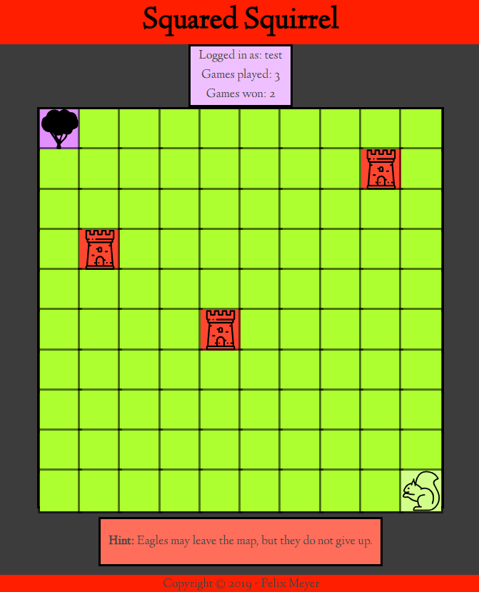

# Squared Squirrel

Link to live app: https://squared-squirrel-app.felixworks.now.sh/

Link to repo of API providing persistent user data (games played and games won): https://github.com/felixworks/squared-squirrel-api/

## Summary

Squared Squirrel is a grid-based browser game that rewards planning and spatial awareness. The goal is to navigate the squirrel back to its home tree while avoiding towers and eagles. The eagles only move when you do.

## Technology used

React, Express, PostgreSQL, Node
